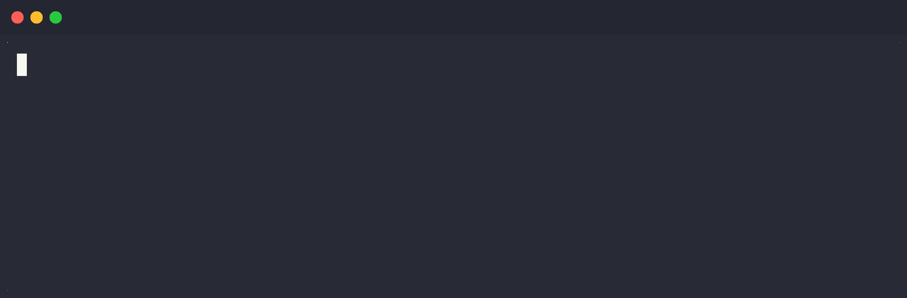

# Nebari Environments

[](https://github.com/nebari-dev/nebari-environments/actions/workflows/publish.yml)



A collection of community-contributed, ready-to-use [Pixi](https://pixi.sh) environments for data science, machine learning, and scientific computing. Environments are automatically published as OCI artifacts to [`quay.io/nebari_environments`](https://quay.io/organization/nebari_environments) and can be imported with a single command using the [nebi](https://github.com/nebari-dev/nebi) CLI.

## Using an environment

Install the [nebi](https://github.com/nebari-dev/nebi) CLI, then import any published environment:

```bash
nebi import quay.io/nebari_environments/data-science-demo:v1
```

This pulls the `pixi.toml` and `pixi.lock` into the current directory. Then install and activate with [Pixi](https://pixi.sh):

```bash
pixi install
pixi shell
```

You can also import into a specific directory or as a global workspace:

```bash
# Import into a specific directory
nebi import quay.io/nebari_environments/data-science-demo:v1 -o ./my-project

# Import as a global workspace
nebi import quay.io/nebari_environments/data-science-demo:v1 --global data-science
```

Browse available environments at [`quay.io/nebari_environments`](https://quay.io/organization/nebari_environments).

## Contributing an environment

1. Create a new directory under `environments/`:
   ```
   mkdir environments/my-env
   ```
2. Add a `pixi.toml` with a `[workspace]` section:
   ```toml
   [workspace]
   name = "my-env"
   channels = ["conda-forge"]
   platforms = ["linux-64", "linux-aarch64", "osx-arm64", "osx-64"]
   version = "0.1.0"

   [dependencies]
   python = ">=3.11"
   # add your packages here
   ```
3. Open a pull request. Once merged to `main`, the environment will be automatically published to `quay.io/nebari_environments/my-env`.

## Repository structure

```
environments/
  <env-name>/
    pixi.toml
```

Each directory under `environments/` is a standalone Pixi environment. The directory name is used as the environment name when publishing.

## CI / Publishing

A GitHub Actions workflow (`.github/workflows/publish.yml`) runs on every push to `main`. It:

1. Downloads the [nebi](https://github.com/nebari-dev/nebi) CLI
2. Starts an ephemeral nebi server
3. Pushes and publishes every environment to `quay.io/nebari_environments/<env-name>`

Nebi handles deduplication server-side, so all environments are published on every run.

### Required GitHub secrets

| Secret | Purpose |
|--------|---------|
| `QUAY_USERNAME` | quay.io robot account username |
| `QUAY_PASSWORD` | quay.io robot account password/token |
| `QUAY_API_TOKEN` | quay.io OAuth token for setting repos to public |

### Quay.io setup

The target organization is [`nebari_environments`](https://quay.io/organization/nebari_environments) on quay.io.

The robot account used by CI needs permission to **create new repositories** in the organization. By default, robot accounts cannot create repos. To grant this:

1. Go to the [nebari_environments org](https://quay.io/organization/nebari_environments) on quay.io
2. Navigate to **Teams and Membership**
3. Create a team (e.g. `ci-publishers`) or use an existing one
4. Set the team's **role to "Creator"** — this allows members to create new repositories
5. Add the robot account to that team (e.g. `nebari_environments+ci`)

The robot account credentials are then stored as `QUAY_USERNAME` and `QUAY_PASSWORD` GitHub secrets on this repository.

New repositories on quay.io are **private by default**. The workflow automatically sets each repository to public after publishing using the quay.io API. This requires an OAuth token (`QUAY_API_TOKEN`) with the **"Administer Repositories"** scope. To generate it:

1. In the same org, navigate to **Applications** (under org settings)
2. Create a new OAuth application (e.g. `ci-visibility`)
3. Generate a token with the **"Administer Repositories"** permission
4. Store the token as the `QUAY_API_TOKEN` GitHub secret on this repository
